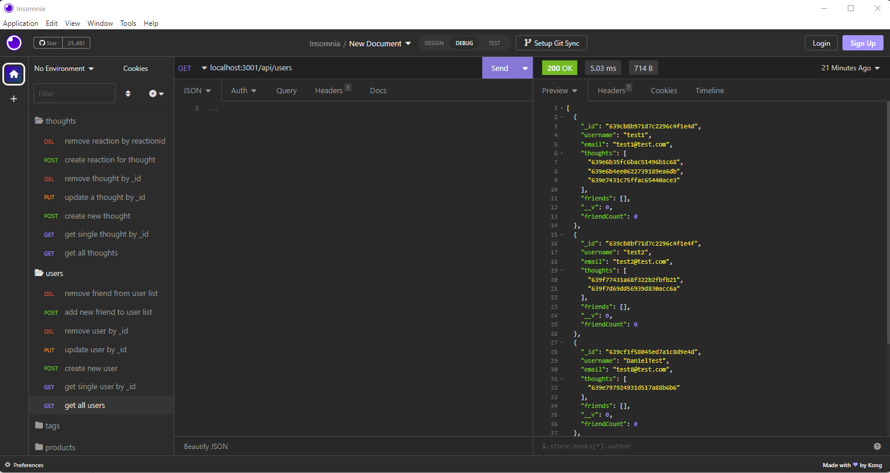

# Social-Network-API

## Description

This application was designed as a back-end demonstration for a social media platform where a user can log thought posts for all users to view and all users can post a reaction to any thought posts they read. In this application, we use Insomnia to show all of the functions of seeing all users in a JSON format, retrieving an individual user by their ID, looking up all thoughts posted all at once, looking up a single thought by the ID, updating users or thoughts, deleting any users or thoughts, adding friends to a user's list, deleting any friends from a user's list and finally posting or deleting reactions to any user's thought.

[Social-Network-API Demo Video](https://drive.google.com/file/d/1SIoxkcxqdEvZod-FkG1xTrGakb9ruYhL/view)

[GitHub Link](https://github.com/Angi-Adema/Social-Network-API)

## Acceptance Criteria

GIVEN a social network API
WHEN I enter the command to invoke the application
THEN my server is started and the Mongoose models are synced to the MongoDB database
WHEN I open API GET routes in Insomnia for users and thoughts
THEN the data for each of these routes is displayed in a formatted JSON
WHEN I test API POST, PUT, and DELETE routes in Insomnia
THEN I am able to successfully create, update, and delete users and thoughts in my database
WHEN I test API POST and DELETE routes in Insomnia
THEN I am able to successfully create and delete reactions to thoughts and add and remove friends to a user’s friend list

## Technologies

JavaScript
Node.js / Express.js
NoSQL
MongoDB / Mongoose
Insomnia

## Run Application

1. npm i
2. npm run watch
